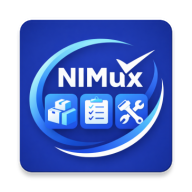
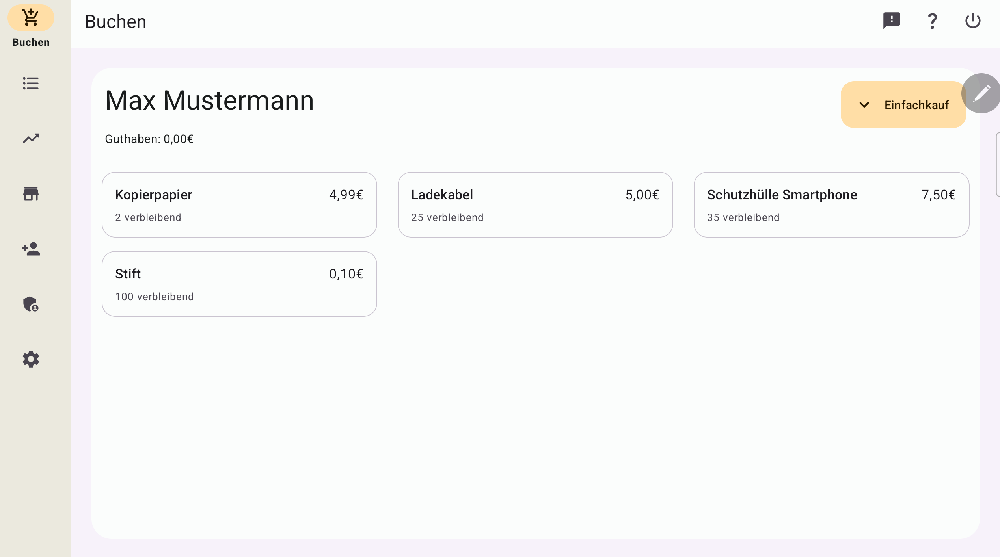
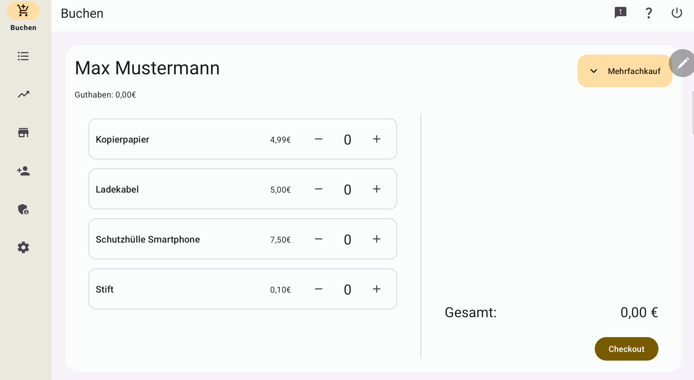
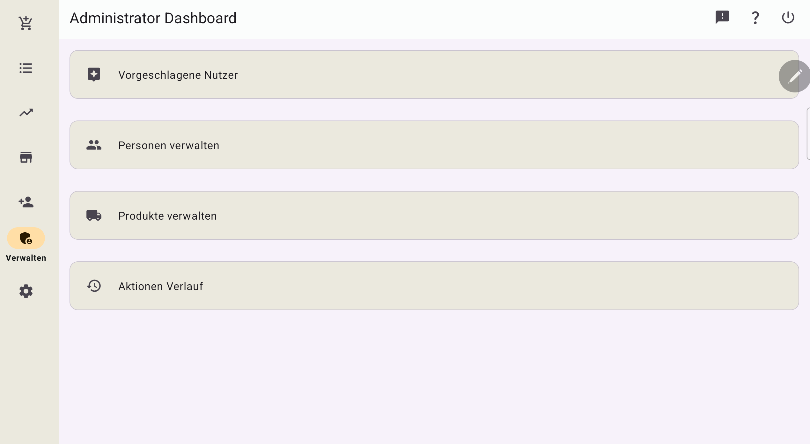

<h1>
  
   
  NIMux
</h1>

[![Made with love by it@M][made-with-love-shield]][itm-opensource]

**NIMux – Everything under control, smartly organized.**

NIMux is a smart native Android app that centrally manages supplies, inventory, materials, and additional resources.  
Keep track of all your stock, work equipment, and resources at any time – ideal for emergency supplies, warehouse management, or everyday operations.

The project main purpose is to provide an easy way to demonstrate the capabilites of an Android app in combination with Firebase services.

## Screenshots

  
  
  

## Built With

Native Android development with Kotlin and XML.

**Used Libraries**

This project uses the following open source libraries:

- AndroidX
- Material Components for Android
- Firebase (Firestore, Auth)
- FirebaseUI
- ML Kit
- TensorFlow Lite
- Retrofit
- OkHttp
- Gson
- Room Database
- CameraX
- Dagger Hilt
- MPAndroidChart
- Kotlin Coroutines
- Timber

All libraries are licensed under the Apache License 2.0 unless otherwise noted.

## Set up

1. Clone the repository: git clone https://github.com/it-at-m/nimux.git

2. Create a new Firebase project.
3. Enable the Authentication module with email and password.
4. Enable Firestore and create a new database with default settings.
5. Start a new collection named "UtilCollection" with document "AlloCreateAccount" which contains field "allow" with boolean value true or false.
6. Add a new collection "tenants" and add a document; e.g. "tenant_demo"
7. Add a new collection "userTenants". Use it to map users to tenants and role. Therefore add a new document with the user id copied from Firebase Authentication. Inside the document create the field "role" with the value "admin" or "access" and the field "tenantId" with the name of the tenant; e.g. "tenant_demo"
8. Add a new collection "helpCollection". If you want you can provide Knowledgebase-articles inside the app. Therefore add a new document with the fields "body" (string), "orderPos" (number) and "title" (string).
9. Inside the firebase console switch to firestore and select the tab "Rules". Copy the provided rules from the file firestore.rules.
10. Download your google-services.json file from the Firebase console and put it inside the /app directory.

## Build the app
1. If you like, change the App ID in `build.gradle.kts` to your own.
2. Open the project in your preferred IDE, sync Gradle, and build.

## Documentation

To use the app on your own you have to set up a firebase project.

**Supported Features**

- Easily add, categorize, and manage items
- Real-time overview of stock levels and check-outs
- Centralized organization of all resources
- Smart extras: analytics

**Adding new organizational unit**
If you want to add another departement in your own firebase instance create a new tenant and map the corresponding user to the tenant and id as described above.

## Contributing

Contributions are what make the open source community such an amazing place to learn, inspire, and
create. Any contributions you make are **greatly appreciated**.

If you have a suggestion that would make this better, please open an issue with the tag "
enhancement", fork the repo and create a pull request. You can also simply open an issue with the
tag "enhancement".
Don't forget to give the project a star! Thanks again!

1. Open an issue with the tag "enhancement"
2. Fork the Project
3. Create your Feature Branch (`git checkout -b feature/AmazingFeature`)
4. Commit your Changes (`git commit -m 'Add some AmazingFeature'`)
5. Push to the Branch (`git push origin feature/AmazingFeature`)
6. Open a Pull Request

More about this in the [CODE_OF_CONDUCT](/CODE_OF_CONDUCT.md) file.

## License

Distributed under the MIT License. See [LICENSE](LICENSE) file for more information.

## Contact

it@M - opensource@muenchen.de

<!-- project shields / links -->

[made-with-love-shield]: https://img.shields.io/badge/made%20with%20%E2%9D%A4%20by-it%40M-yellow?style=for-the-badge

[itm-opensource]: https://opensource.muenchen.de/

- check all files in repo
- rename application id before push project
- push to github
- security scan der apk
- create public play store presence
- cleanup firebase kaffekasse appcenter und google play console